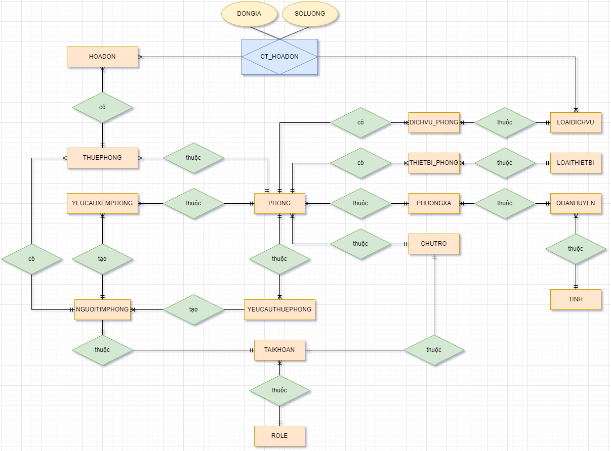

# Xây dựng database cho thuê phòng của nhà trọ

## Mục tiêu

- Xây dựng database cho phép chủ trọ đăng phòng cho thuê. Người tìm phòng có thể tìm phòng, đặt lịch hẹn xem phòng và yêu cầu thuê phòng.

## Khảo sát thực tế

- Các chủ trọ sẽ được phép đăng phòng cho thuê. Để thuận tiện cho việc liên lạc và quản lý, database sẽ giữ lại thông tin của các chủ trọ. Mỗi chủ trọ sẽ có mã riêng, họ đệm, tên, số căn cước, giới tính, ngày sinh, email, số điện thoại. Số căn cước không được trùng nhau.

- Người tìm phòng sẽ được phép tìm thông tin các phòng trọ đã đăng. Để thuận tiện cho việc liên lạc và quản lý, database sẽ giữ lại thông tin của các người tìm phòng.  mỗi người tìm phòng sẽ có mã riêng, họ đệm, tên, số căn cước, giới tính, ngày sinh, email, số điện thoại. Số căn cước không được trùng nhau.

- Người tìm phòng và chủ trọ có thể đăng nhập và thực hiện các chức năng dựa vào role của mình. Mỗi người tìm phòng và chủ trọ sẽ có username và password riêng để đăng nhập.

- Nếu người dùng không đăng nhập thì chỉ có thể xem được thông tin các phòng trọ đã đăng, đăng nhập tài khoản đã có hoặc đăng ký tài khoản mới.

- Chủ trọ có thể đăng cho thuê nhiều phòng. Chủ trọ có thể có nhiều phòng cho thuê cùng một lúc. Mỗi phòng chỉ thuộc 1 chủ trọ. Người tìm phòng có thể truy vấn được các phòng còn trống hoặc các phòng mà một chủ trọ đã đăng. Mỗi phòng trọ sẽ có mã phòng riêng, tên phòng, địa chỉ nhà, mã phường xã, số lượng người tối đa, diện tích phòng, giá thuê, tình trạng phòng, mã chủ trọ, mã người thuê hiện tại, trạng thái ẩn và phần mô tả thêm.

- Chủ trọ có thể chỉnh sửa thông tin, ẩn và xoá các phòng trọ mà mình đã đăng.

- Để thuận tiện cho việc tìm được phòng trọ theo khu vực mà mình mong muốn, người tìm phòng có thể lọc phòng trọ theo tỉnh, quận huyện, phường xã.

- Có nhiều phường xã, mỗi phường xã có thể có nhiều phòng trọ, mỗi phòng trọ chỉ thuộc 1 phường xã. Tên các phường xã trong cùng 1 quận huyện không được trùng nhau.

- Có nhiều quận huyện, mỗi quận huyện có thể chứa nhiều phường xã, mỗi phường xã chỉ thuộc 1 quận huyện. Tên các quận huyện trong cùng 1 tỉnh trong được trùng nhau.

- Có nhiều tỉnh, mỗi tỉnh có thể chứa nhiều quận huyện, mỗi quận huyện chỉ thuộc 1 tỉnh. Tên các tỉnh không được trùng nhau.

- Các phòng trọ có thể đi kèm các dịch vụ như: Điện, nước, wifi, giữ xe,... Có nhiều loại dịch vụ khác nhau, mỗi loại dịch vụ sẽ có mã và tên riêng. Tên các dịch vụ không được trùng nhau. Nhiều phòng trọ có thể có cùng 1 loại dịch vụ và 1 phòng trọ có thể có nhiều loại dịch vụ. Mỗi phòng phải chỉ rõ giá của từng loại dịch vụ (cùng 1 dịch vụ có thể có nhiều giá khác nhau tuỳ phòng, ví dụ: phòng A có giá wifi là 50.000đ còn phòng B có giá wifi là 60.000đ). Chủ trọ có thể chọn các loại dịch vụ từ database, nếu chưa có thì chủ trọ có thể tự thêm loại dịch vụ mới vào database.

- Các phòng trọ có thể đi kèm các thiết bị như: Tủ lạnh, máy lạnh, tivi,... Có nhiều loại thiết bị khác nhau, mỗi thiết bị sẽ có mã và tên riêng. Tên thiết bị không được trùng nhau. Nhiều phòng trọ có thể có cùng 1 loại thiết bị và 1 phòng trọ có thể có nhiều loại thiết bị. Mỗi phòng phải chỉ rõ số lượng và tình trạng của mỗi loại thiết bị mà phòng trọ có. Chủ trọ có thể chọn các loại thiết bị từ database, nếu chưa có thì chủ trọ có thể tự thêm loại thiết bị mới vào database.

- Sau khi đọc thông tin của phòng trọ, nếu ưng ý thì người tìm phòng có thể đặt lịch hẹn xem phòng để tìm hiểu thêm. Người tìm phòng có thể huỷ yêu cầu đặt lịch hẹn xem phòng trong trường hợp có việc đột xuất nếu yêu cầu đang chờ duyệt hoặc đã được đồng ý bởi chủ trọ. Người chủ trọ có thể từ chối yêu cầu đặt lịch hẹn xem phòng nếu có việc bận. Nếu chủ trọ từ chối yêu cầu thì phải ghi lý do từ chối và ghi lại ngày giờ từ chối. Người tìm phòng có thể đặt nhiều yêu cầu đặt nhiều lịch hẹn xem phòng cho các phòng trọ khác nhau nhưng phải khác ngày giờ. Nếu cùng 1 phòng trọ thì yêu cầu đặt lịch hẹn xem phòng hiện tại phải bị từ chối/đồng ý/huỷ mới được đặt lại lịch hẹn xem phòng mới cho phòng đó vào ngày giờ khác. Một phòng trọ có thể có nhiều yêu cầu đặt lịch hẹn xem phòng. Mỗi lần yêu cầu phải ghi nhận thông tin ngày giờ yêu cầu, ngày giờ hẹn xem, trạng thái yêu cầu, lý do từ chối, ngày giờ từ chối. Các trạng thái yêu cầu có thể là "Chờ duyệt", "Đồng ý" (chủ trọ đồng ý), "Từ chối" (chủ trọ từ chối), "Huỷ" (người tìm phòng huỷ).

- Nếu ưng ý với một phòng trọ nào đó, người tìm phòng có thể yêu cầu thuê phòng. Người tìm phòng có thể huỷ yêu cầu xem phòng trong trường hợp đổi quyết định nếu yêu cầu đang chờ duyệt. Người chủ trọ có thể từ chối yêu cầu thuê và phải ghi lý do từ chối và ghi lại ngày giờ từ chối. Người tìm phòng có thể yêu cầu thuê nhiều phòng trọ cùng một lúc. Nếu cùng 1 phòng trọ thì yêu cầu thuê hiện tại phải bị từ chối/đồng ý/huỷ mới được đặt lại yêu cầu thuê phòng mới cho phòng đó. Một phòng trọ có thể có nhiều yêu cầu thuê. Mỗi lần yêu cầu phải ghi nhận thông tin ngày giờ yêu cầu, trạng thái yêu cầu, lý do từ chối, ngày giờ từ chối. Các trạng thái yêu cầu có thể là "Chờ duyệt", "Đồng ý" (chủ trọ đồng ý), "Từ chối" (chủ trọ từ chối), "Huỷ" (người tìm phòng huỷ).

- Sau khi chủ trọ đồng ý yêu cầu thuê một phòng nào đó thì phòng đó sẽ ở trạng thái đã được thuê và ghi lại mã người yêu cầu thuê để biết phòng đó đã được thuê hay chưa. Nếu một phòng đã được thuê thì các người tìm phòng khác sẽ:
  - Không được đặt lịch hẹn xem phòng
  - Không được đặt yêu cầu thuê phòng
  - Vẫn có thể tìm và đọc thông tin phòng

- Nếu phòng đang được thuê thì chủ trọ có thể nhấn trả phòng (xoá mã người thuê hiện tại) để người tìm phòng khác có thể đặt lịch hẹn xem phòng và yêu cầu xem phòng.

- Chủ trọ có thể ẩn phòng mà mình đã đăng. Nếu một phòng bị ẩn thì các người tìm phòng sẽ:
  - Không tìm được phòng (trừ người thuê hiện tại nếu phòng đang được thuê)
  - Không đọc được thông tin phòng (trừ người thuê hiện tại nếu phòng đang được thuê)
  - Không được đặt lịch hẹn xem phòng
  - Không được đặt yêu cầu thuê phòng

## Xác định thực thể

- role (<ins>ma_role</ins>, ten_role)
- dang_nhap (<ins>username</ins>, password)
- nguoi_tim_phong (<ins>ma_nguoi_tim_phong</ins>, ho_dem, ten, so_can_cuoc, gioi_tinh, ngay_sinh, email, so_dien_thoai)
- chu_tro (<ins>ma_chu_tro</ins>, ho_dem, ten, so_can_cuoc, gioi_tinh, ngay_sinh, email, so_dien_thoai)
- tinh (<ins>ma_tinh</ins>, ten_tinh)
- quan_huyen (<ins>ma_quan_huyen</ins>, ten_quan_huyen)
- phuong_xa (<ins>ma_phuong_xa</ins>, ten_phuong_xa)
- phong (<ins>ma_phong</ins>, ten_phong, so_nha, so_luong_nguoi, dien_tich_phong, gia_thue, tinh_trang_phong, trang_thai_an)
- dich_vu (<ins>ma_dich_vu</ins>, ten_dich_vu)
- thiet_bi (<ins>ma_thiet_bi</ins>, ten_thiet_bi, tinh_trang)

## Các đối tượng sử dụng database

Gồm:
- Khách
- Người tìm phòng
- Chủ trọ
- Admin

### Các chức năng của từng đối tượng

- Khách:
  - Tìm phòng trọ
  - Đọc thông tin phòng trọ
  - Đăng nhập
  - Đăng ký tài khoản mới

- Người tìm phòng:
  - Chỉnh sửa thông tin cá nhân
  - Đổi password
  - Tìm phòng trọ
  - Đọc thông tin phòng trọ
  - Đọc thông tin chủ phòng trọ
  - Yêu cầu đặt lịch hẹn xem phòng
  - Yêu cầu thuê

- Chủ trọ:
  - Chỉnh sửa thông tin cá nhân 
  - Đổi password
  - Đăng phòng trọ cho thuê
  - Đọc thông tin phòng trọ
  - Chỉnh sửa thông tin phòng trọ đã đăng
  - Xoá phòng trọ đã đăng
  - Ẩn phòng trọ đã đăng
  - Đọc thông tin của người tìm trọ yêu cầu hẹn xem phòng/yêu cầu thuê
  - Chấp nhận, từ chối yêu cầu đặt lịch hẹn xem phòng
  - Chấp nhận, từ chối yêu cầu thuê phòng
  - Nhấn trả phòng

- Admin:
  - Tìm phòng trọ
  - Đọc thông tin phòng trọ
  - Chỉnh sửa thông tin các phòng trọ
  - Ẩn các phòng trọ
  - Xoá các phòng trọ
  - Đọc thông tin các người tìm phòng và chủ trọ
  - Chỉnh sửa thông tin của người tìm phòng và chủ trọ
  - Đổi password của các người tìm phòng và chủ trọ

## Sơ đồ ERD

